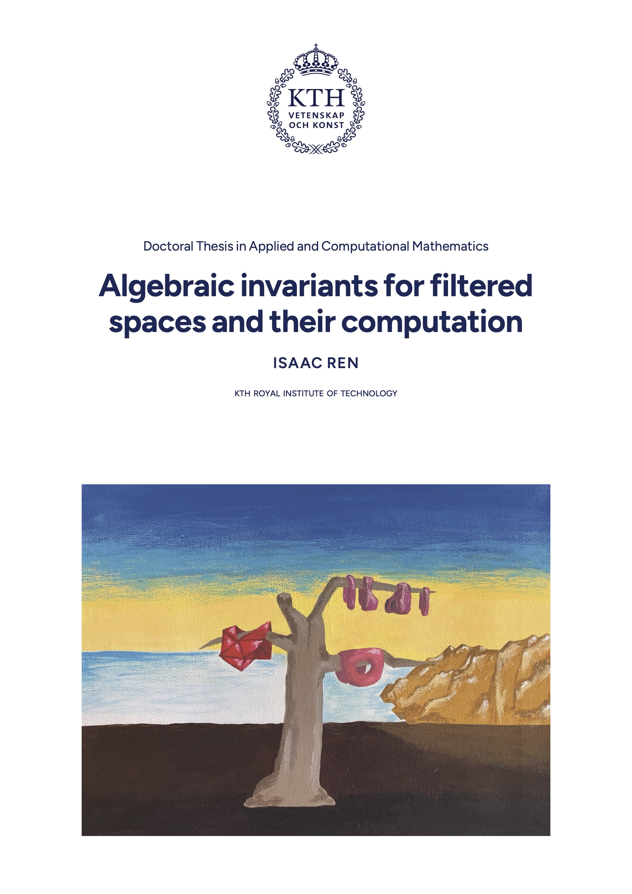

My PhD thesis
=============

This repository contains my PhD thesis, [Algebraic invariants for filtered
spaces and their computation](https://urn.kb.se/resolve?urn=urn:nbn:se:kth:diva-380673).

My thesis uses my LuaLaTeX thesis class [`kthpq-thesis`](https://github.com/th-rtyf-re/kthpq-thesis),
with some modifications.

<p align="center"></p>

How it works
------------

This section is mostly a reminder for myself. I wrote these files in [VS Code](https://code.visualstudio.com/)
with the [LaTeX Workshop](https://github.com/james-yu/latex-workshop) extension.

### Structure

The main file is [`thesis-main.tex`](thesis-main.tex). The inputted files are
split into [`headers`](headers/) for the preamble, [`includes`](includes/) for
the main thesis content, and [`papers`](papers/) for the included papers.
Figures are found in [`figs`](figs/), bibliographic entries in [`bib`](bib/).

### Programs and scripts

Various programs and scripts were used to make this thesis; they are located in
[`util`](util/).

* [`flipbook.py`](util/flipbook.py) generates the flipbook in the _kappa_, with
  some extra functions to interact with the filtered simplicial complex. Before
  running this, be sure to create the directory `figs/flip/`.
* [`morse.py`](util/morse.py) generates the example of critical points of a
  height function on a torus (page 41). Before running this, be sure to create
  the directory `figs/morse/`.
* [`split.sh`](util/split.sh) splits the output PDF into parts that KTH's
  printing service, US-AB, likes. This script requires [Coherent PDF Tools](https://www.coherentpdf.com/).
  Before running this, be sure to create the directory `util/split/`.

### `blacktext`

As a micro-optimization of the printed thesis, I edited the two published
papers' PDFs to make all of the text black (links were blue). I did this using
the command

```
cpdf -blacktext in.pdf -o out.pdf
```

from Coherent PDF Tools. If you want to produce a digital full-color version of
this thesis, then you can download the published papers freely, as they are
open access.

Errata
------

The published version of this thesis is version 1.1 (May 3, 2026, commit
[1d293f7](https://github.com/th-rtyf-re/phd-thesis/commit/1d293f777b425198f08d835f976b068cbe7511fc)).
Since then, the following mistakes have been found:

* On page viii (Popular science summary), the phrase
  
  > ..., where the filtrations values...
  
  is missing an apostrophe: "_filtration's_ values".
* On page 25 (Remark 2.45), page 190 (Paper C, Equation C.2), and page 197
  (Paper C, Definition C.25), the direct sum or product of hom-spaces should be
  a product on $i$ and a direct sum on $j$: this is the correct way of
  decomposing the hom-space between p.f.d. modules. Note in particular that the
  column-finiteness property follows immediately.
* On page 193 (Paper C, Definition C.19), the definition of p-costs for
  multiset matchings is wrong. Specifically, it is missing the contribution of
  unmatched bars. The definition is not used in the paper, though.
* In Paper C, several figures have old-style numerals instead of lining ones.
  Specifically, the affected numerals are on page 194 (Figure C.2), page 196
  (Figure C.3), and page 207 (Example C.43).
* In Paper C, the term "canonical matching" appears several times, first on
  page 214, in Proposition C.53. This term is never defined. It should refer
  to the canonical injections of Bauer and Lesnick (2015), viewed as barcode
  matchings.
* On page 222 (Paper C, proof of Theorem C.68), the words "algebraic matching"
  should be removed from the passage
  
  > (of strictly bar-to-bar/algebraic matching morphisms)
  
* On page 233 (Paper D, Section D.1.4), the
  
  > description (D.1.2)
  
  should refer to the equation in Section D.1.2; this equation should have been
  numbered, and indeed is in the arXiv version of the paper.
* On page 245 (Paper D, proof of Proposition D.21), the
  
  > Equations (D.2.2) and (D.2.2)
  
  are referring to the two previous equations, which should have been numbered,
  and indeed are in the arXiv version of the paper.

Note that there is a small mistake on page 91, Section 4.4 of Paper A. This is
acknowledged and corrected on pages 48-49, in Chapter 4.

License
-------

The published version of this thesis is copyrighted by me, Isaac Ren. I'm not
really sure what the legal implications are for the repository, but you can
copy the "code" part of this repository, e.g., the various macros and hacks
used on top of `kthpq-thesis`. However, maybe avoid copying the content of the
thesis and the included papers :)
